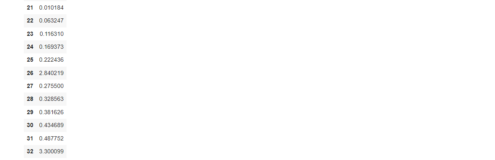

# Exno:1
Data Cleaning Process

# AIM
To read the given data and perform data cleaning and save the cleaned data to a file.

# Explanation
Data cleaning is the process of preparing data for analysis by removing or modifying data that is incorrect ,incompleted , irrelevant , duplicated or improperly formatted. Data cleaning is not simply about erasing data ,but rather finding a way to maximize datasets accuracy without necessarily deleting the information.

# Algorithm
STEP 1: Read the given Data

STEP 2: Get the information about the data

STEP 3: Remove the null values from the data

STEP 4: Save the Clean data to the file

STEP 5: Remove outliers using IQR

STEP 6: Use zscore of to remove outliers

# Coding and Output
```
import pandas as pd
df=pd.read_csv("/content/SAMPLEIDS.csv")
df
```


```
print(df.head(8))
```


```
print(df.tail(5))
```


```
print(df.describe())
```


```
df.info()
```


```
df.isnull().sum()
```


```
df.nunique()
```


```
mn=df.TOTAL.mean()
mn
```


```
df.TOTAL.fillna(mn,inplace=True)
td=df.TOTAL.fillna(mn,inplace=True)
df
```


```
x=df.M4.mean()
x
```


```
df.M4.fillna(x,inplace=True)
df
```


```
import pandas as pd
import seaborn as sns
import numpy as np
age=[1,3,28,27,25,92,30,39,40,50,26,24,29,94]
af=pd.DataFrame(age)
af
```


```
sns.boxplot(data=af)
```


```
sns.scatterplot(data=af)
```


```
q1=af.quantile(0.25)
q2=af.quantile(0.5)
q3=af.quantile(0.75)
iqr=q3-q1
iqr
lower_bound = q1 - 1.5 * iqr
lower_bound
upper_bound = q3 + 1.5 * iqr
upper_bound
```


```
af=af[((af>=lower_bound)&(af<=upper_bound))]
af
```


```
af.dropna()
```


```
sns.boxplot(data=af)
```


```
sns.scatterplot(data=af)
```


```
import pandas as pd
import numpy as np
import seaborn as sns
from scipy import stats
data={'weight':[12,15,18,21,24,27,30,33,36,39,42,45,48,51,54,57,60,63,66,69,202,72,75,78,81,84,232,87,90,93,96,99,258]}
df=pd.DataFrame(data)
df
```


```
import numpy as np
from scipy import stats
z=np.abs(stats.zscore(df))
z
```



# Result
Thus the given program executed successfully.
